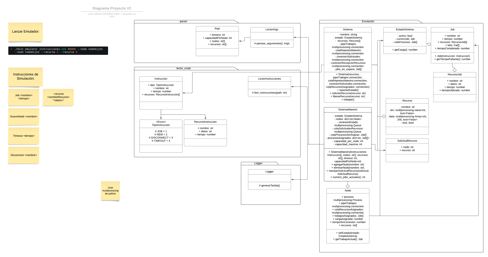

# distributed-os-emulator
El programa fue creado por Victoria Sandi Barrantes y Luis Carlos Navarro Todd.
Se basa en una emulación de un sistema distribuido donde los diferentes sistemas son procesos del paquete de python multiprocessing. Este paquete, al trabajar con procesos, no se ve limitado por el GIL de python. Para la comunicacion entre sistemas, se utilizaron pipes y queues entre los procesos dependiendo de lo que se necesitara. Cada sistema que no sea el maestro se le asignan trabajos, que van avanzando segundo a segundo. Los trabajos pueden necesitar recursos por lo que los sistemas deberan solicitar al maestro los recursos que ocupen. Al finalizar un trabajo el sistema avisa al maestro, eliminando el job del sistema y siguiendo con los siguientes jobs asignados. El sistema, va leyendo un script que indica instrucciones como la existencia de un nuevo job, la adicion de un nodo adicional o la desconexión de un nodo, para simular fallos. También, dicho script puede tener un timeout, en el que el sistema se queda inactivo. 

## Otros detalles

### Link al Repositorio
https://github.com/Vsandi/distributed-os-emulator
### Diseño

## Ejemplos
### Distribucion correcta del trabajo

### Adicion de Nodos

### Manejo de Desconexiones

## Problemas conocidos

### Deadlocks:
Dentro de la emulacion pueden ocurrir deadlocks por los recursos del sistema.