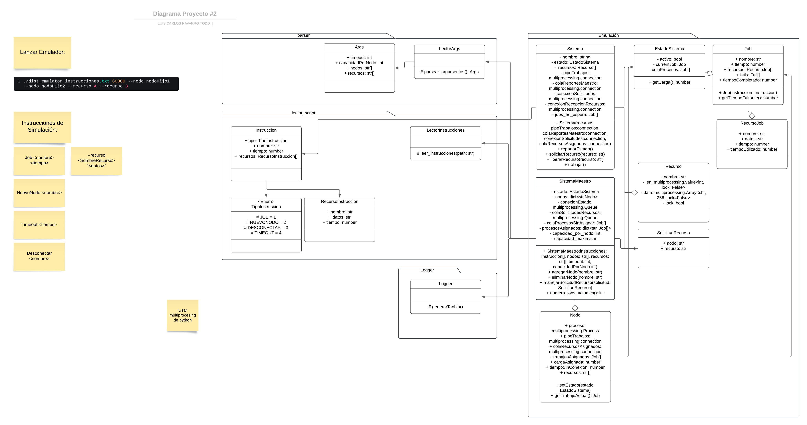

# distributed-os-emulator
El programa fue creado por Victoria Sandi Barrantes y Luis Carlos Navarro Todd.
Se basa en una emulación de un sistema distribuido donde los diferentes sistemas son procesos del paquete de python multiprocessing. Este paquete, al trabajar con procesos, no se ve limitado por el GIL de python. Para la comunicacion entre sistemas, se utilizaron pipes y queues entre los procesos dependiendo de lo que se necesitara. Cada sistema que no sea el maestro se le asignan trabajos, que van avanzando segundo a segundo. Los trabajos pueden necesitar recursos por lo que los sistemas deberan solicitar al maestro los recursos que ocupen. Al finalizar un trabajo el sistema avisa al maestro, eliminando el job del sistema y siguiendo con los siguientes jobs asignados. El sistema, va leyendo un script que indica instrucciones como la existencia de un nuevo job, la adicion de un nodo adicional o la desconexión de un nodo, para simular fallos. También, dicho script puede tener un timeout, en el que el sistema se queda inactivo. 

## Otros detalles

### Uso y Ayuda
#### Ejemplo uso
```shell
python3 main.py ./instrucciones.txt 100 3 --nodo Nodo1 --nodo Nodo2 --recurso Recurso1 --recurso Recurso2
```
#### Ayuda
Se puede ver la descripcion con el siguiente commando:
```shell
python3 main.py --help
```
### Link al Repositorio
https://github.com/Vsandi/distributed-os-emulator
### Diseño


## Ejemplos
### Distribucion correcta del trabajo, Manejo correcto de Recursos y Adición de Nodos
[](https://youtu.be/0rsdn4iTmdU)

Se puede evidenciar como el sistema maneja las instrucciones en el archivo ```instrucciones.txt```. En principio existen dos nodos y se reciben 3 trabajos. El trabajo 1 y el trabajo 2 ocupan el mismo recurso, por lo que el sistema nodo 2 espera que el nodo 1 termine el trabajo 1 para seguir. Tambien se puede ver como se puede añadir un tercer nodo.
### Manejo de Desconexiones
[](https://youtu.be/-Q2yMUYXCjI)

Se puede evidenciar cómo el sistema maneja la desconexion de un nodo, ejecutando el archivo ```desconexion.txt```. En este caso hay dos nodos y 3 trabajos. Se puede ver como al primer nodo se le asigna el trabajo 1 con los recursos Recurso1 y Recurso2, y posteriormente sufre una desconexion. Que en este caso, el sistema reasigna los trabajos al otro nodo y libera los recursos para su uso. En este caso, al nodo 2 se le asignan los trabajos Trajo1 y Trabajo3 que estaban asignados al nodo 1.

## Problemas conocidos

### Deadlocks:
Dentro de la emulacion pueden ocurrir deadlocks por los recursos del sistema.